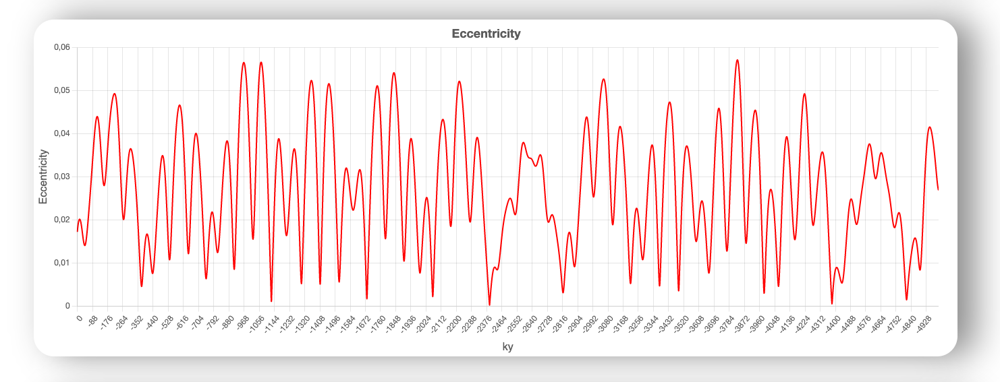
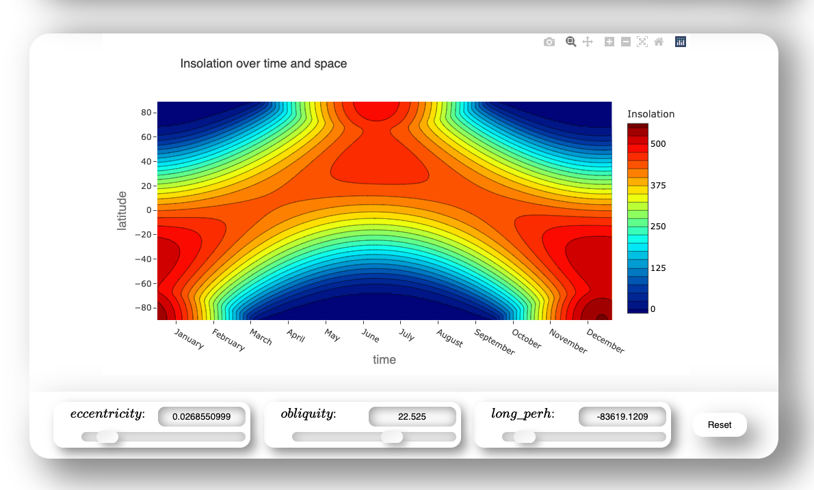

# Orbit-astronomical-theory-of-ice-ages

This repository includes a website, as well as a Jupyter notebook, which provides as teaching material for various courses. It was created for the course "Climate Systems II" at the University of Bremen.

Insolation for 5000ky ago until today:

Eccentricity for 5000ky ago until today:

Insolation over time and space:

## Availability

This can be found here: [www.awi.de/...](https://www.awi.de/fileadmin/user_upload/AWI/Forschung/Klimawissenschaft/Dynamik_des_Palaeoklimas/OrbitalTheoryOfIceAges/) and <a href="https://b-schwertfeger.de/projects/awi-work/OrbitalTheory/" target="_blank" >here</a> in case the first link does not work anymore.

## References

Calculations, plots and illustrations are based on the work of Ian Eisenman and Peter Huybers (August 2006). An R implementation by Thomas Leapple served as orientation.

- P. Huybers and I. Eisenman, 2006. Integrated summer insolation calculations. NOAA/NCDC Paleoclimatology Program Data Contribution #2006-079.
- Berger A. and Loutre M.F. (1991). Insolation values for the climate of the last 10 million years. Quaternary Science Reviews, 10(4), 297-317.
- Berger A. (1978). Long-term variations of daily insolation and Quaternary climatic changes. Journal of Atmospheric Science, 35(12), 2362-2367.

Orbital data source:
http://eisenman.ucsd.edu/code/daily_insolation.m
